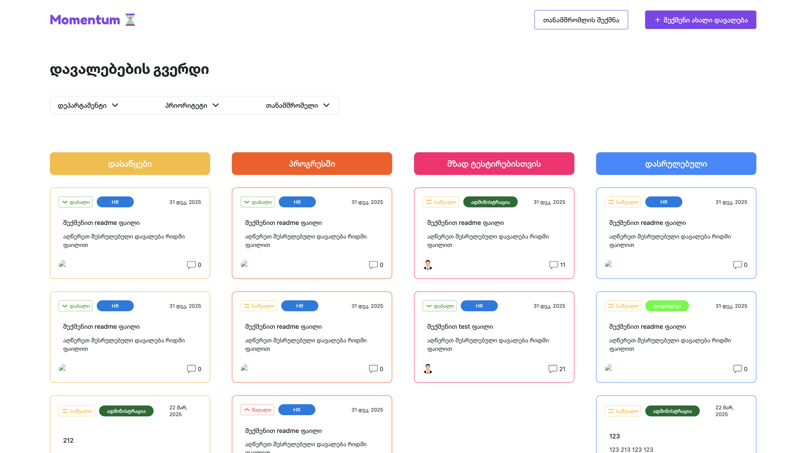
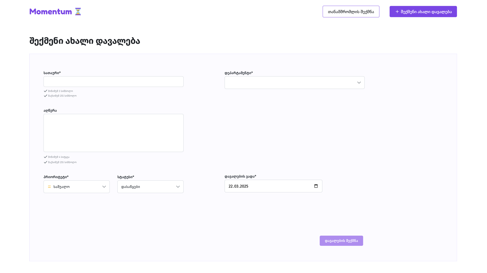

# Momentum - Task and Employee Progress Tracking App
[Momentum](https://zeizvant.github.io/momentum/)

## Description

Momentum is a React application built with Vite that provides a platform to track tasks, manage employees, and monitor progress. It offers features to view task details, assign tasks to employees, add comments, and filter tasks based on various criteria.

## Screenshots




## Features

* **Task Management:** Create, view, and update tasks.
* **Employee Assignment:** Assign tasks to specific employees.
* **Progress Tracking:** Monitor the progress of each task.
* **Comments:** Add and view comments on tasks.
* **Filtering:** Filter tasks based on status, employee, and other criteria.

## Technologies Used

* **React:** For building the user interface.
* **Vite:** For fast development and build process.
* **JavaScript (ES6+):** For application logic.
* **TailwindCss:** For styling.

## **Key Directories and Files:**

* **`src/`:** Contains all the source code for the application.
    * **`assets/`:** Stores static assets like images, icons, and other media files.
    * **`components/`:** Holds reusable React components.
        * **`buttons/`:** Contains button-related components.
        * **`comment/`:** Components for handling comments on tasks.
        * **`employeeForm/`:** Components for employee form and related functionality.
        * **`filter/`:** Components for filtering tasks based on various criteria.
        * **`listing/`:** Components for displaying lists of tasks.
        * **`task/`:** Components related to individual task items.
        * **`taskForm/`:** Components for creating and editing tasks.
        * **`CommentSection.jsx`, `CustomDropdown.jsx`, `EmployeeModal.jsx`, `Modal.jsx`, `Navbar.jsx`, `StatusDropdown.jsx`, `TaskDetails.jsx`:** Individual components for specific functionalities.
    * **`config/`:** Contains configuration files, such as API endpoints in `api.js`.
    * **`hooks/`:** Stores custom React hooks for reusable logic.
    * **`pages/`:** Holds components that represent different pages or views of the application.
    * **`store/`:** (If used) Contains state management logic using tools like Redux .
    * **`utils/`:** Stores utility functions for common tasks across the application.
    * **`App.jsx`:** The root component of the React application, responsible for rendering the main layout and routing.
    * **`index.css`:** Contains global CSS styles for the application.
    * **`main.jsx`:** The entry point of the React application, where the root component is rendered into the DOM.


## Getting Started

Follow these steps to get the project running on your local machine:

### Prerequisites

* **Node.js:** Ensure Node.js is installed on your system. You can download it from [nodejs.org](https://nodejs.org/).
* **npm or Yarn:** You'll need npm (Node Package Manager) or Yarn. If you installed Node.js, npm comes bundled with it.

### Installation

1.  **Clone the repository:**

    ```bash
    git clone [https://github.com/Zeizvant/momentum.git](https://www.google.com/search?q=https://github.com/Zeizvant/momentum.git)
    cd momentum
    ```

2.  **Install dependencies:**

    Using npm:

    ```bash
    npm install
    ```

    Or using Yarn:

    ```bash
    yarn install
    ```

### Running the Application

1.  **Start the development server:**

    Using npm:

    ```bash
    npm run dev
    ```

    Or using Yarn:

    ```bash
    yarn dev
    ```

2.  **Open your browser:**

    The application will be running at `http://localhost:5173/` (or a similar address displayed in your terminal).

### Building for Production

To create a production build, run:

Using npm:

```bash
npm run build